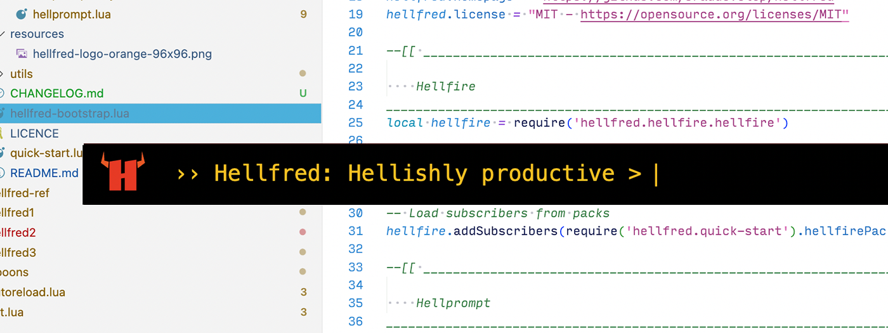
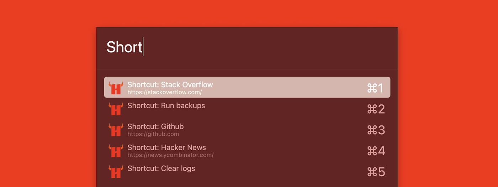
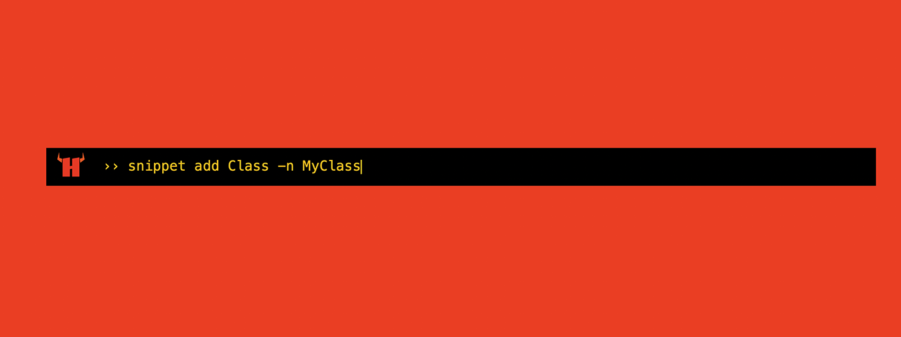
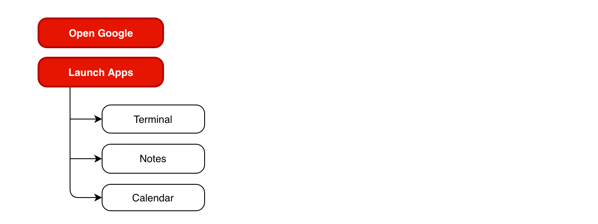
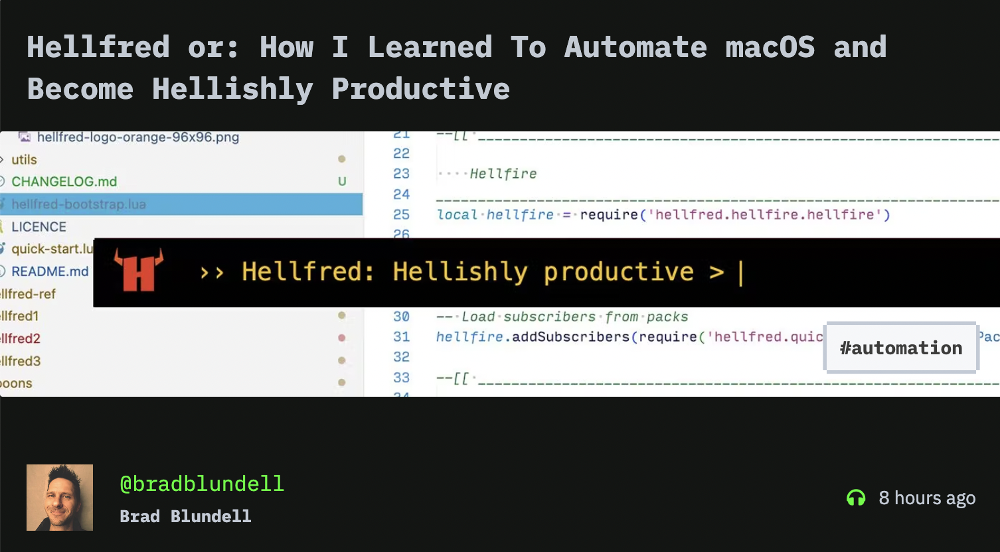

# Hellfred. `Hellishly productive.`
> Built on Hammerspoon for macOS automation.

<br>



### Contents
- [What the hell is Hellfred?](#what-the-hell-is-hellfred)
- [The Apps](#the-apps)
- [Installation: Firestarter](#installation-firestarter)
- [Bootstrap: Light it up](#bootstrap-light-it-up)
- [Tutorial: A basic setup](#tutorial-a-basic-setup)

## What the hell is Hellfred?
Hellfred is a collection of 3 mini-apps built on top of Hammerspoon so you can automate tasks, boost productivity and eliminate time-suck by programming shortcuts into your daily workflows.

> It's a way to map repetitive time consuming tasks to key sequences, commands or searchable texts.

Each app is a different **style of interface** that map `triggers` to the `behaviours or actions` they should perform.


*Hellfuzz. A fuzzy search, choice-to-behaviour mapper.*


*Hellfire. A keys-to-behaviour mapper.*


*Hellprompt. A command-to-behaviour mapper.*

### Triggers and callbacks
| App  | Trigger(s) | Callback (Behaviour) |
| ------------- | -------- | ------------------- |
| Hellfire     | <ul> <li>Single key. &nbsp;<kbd>x</kbd></li> <li>Single key with modifiers. &nbsp;<kbd>⌘&nbsp;⌥</kbd><kbd>x</kbd></li> <li>Key sequences. &nbsp;<kbd>⌘</kbd><kbd>k</kbd> , <kbd>x</kbd></li> </ul> | User defined function         |
| Hellfuzz     | A searchable list of choices.<br> Selecting a choice fires the trigger. | User defined function<br> Choice metadata is passed to it|
| Hellprompt   | A text command | User defined function<br>The command is passed to it |


### Subscribers
The `trigger` and `callback` are user-defined by wrapping them inside simple configuration objects. These objects, act as `subscribers` and are registered with the respective app and notified whenever something important happens inside the app.


## The Apps
### Hellfire
>A quick-fire, mode-based, hotkey-to-action mapping utility.
>- Supports single key triggers as well as key chord sequences as triggers.
>- Exposes virtually every key on the keyboard including modifier keys to use as triggers.
>- Modes allow the same trigger to have different behaviours under different contexts.

English, please?
> When I type a character or a sequence of characters, then execute a specific function, but only if I am in a particular mode!

Ok. An example maybe?
>- When I type <kbd>c</kbd> then run function `launchGoogleChromeApp` (but only if I am in Default Mode)
>- When I type <kbd>w</kbd>+<kbd>m</kbd> then run function `changeToWindowManagerMode` (again, whilst in Default Mode)
>- When I type <kbd>c</kbd> then run function `centerWindowOnScreen` (whilst in WindowManager mode)

### Hellfuzz
>A fuzzy-search chooser utility with choice-to-action mapping.
>- Supports multi-level (nested) choice sets.

English, please?
> When I search through a list of choices and select one, then execute a specific function.<br>
If my choice has subchoices (think:`parent->children`), then show me those so I can search through them.

Ok. An example maybe?<br>
>Suppose you have this structure:
hellfuzz-example-apps-struct.png


>- When I type '**goog**', then highlight the choice '**Open Google**'. Selecting this option will execute the function `openGoogleInBrowser`.
>- Alternatively, if I type '**app**', then highlight the choice '**Launch Apps**'. Selecting this option will replace the current choices with **Terminal, Notes, and Calendar** (the subset of choices for **Launch Apps**)
>- When I fuzzy search through those and select one, Hellfuzz will execute `launchOrOpenApp` with the selected app.


### Hellprompt
>A commandline-like utility with basic string match support.

English, please?
>When I type out a command and submit it, then inspect my command for any matching string patterns and execute functions related to that command.

Ok. An example maybe?
>- When I type the command '**open notes**' and then hit <kbd>enter</kbd>, then execute any function with a `filter` (e.g. command must start with the word '**open**') and behaviour (e.g. open app associated with '**notes**') suitable to open the Notes app.
>- When I type '**browse github**' and then hit <kbd>enter</kbd>, then execute any function with a filter (e.g. command starts with the word '**browse**') and behaviour (open url associated with '**github**') suitable to open the link.


## Installation: Firestarter
1. Download and install [Hammerspoon](https://github.com/Hammerspoon/hammerspoon/releases)
2. Install Hellfred: Clone the repository to your `~/.hammerspoon` directory:
```bash
git clone https://github.com/braddevelop/hellfred.git ~/.hammerspoon
```


## Bootstrap: Light it up

There is a **bootstrap file** for Hellfred with a pre-configured setup. Let's reference it in Hammerspoon's `init.lua` file

```lua
-- ~/.hammerspoon/init.lua

require('hellfred.hellfred-bootstrap')
```

Save the file and reload the configuration (or save yourself some time and use [fancy reload](http://www.hammerspoon.org/go/#fancyreload))

### What's in the box? Try out the pre-configuration
Out-the-box the three Hellfred apps are ready to use and are pre-configured with a quick-start example. Let's test it out to make sure everything is wiring and firing.

#### Try Hellfire
- Open **Hellfire** with the hotkey <kbd>shift</kbd>+<kbd>⌘</kbd>+<kbd>h</kbd>
- Type the character <kbd>c</kbd>
- The repo for Hellfred will open in a browser.

#### Try Hellfuzz
- Open **Hellfuzz** with the hotkey <kbd>shift</kbd>+<kbd>⌥</kbd>+<kbd>h</kbd>
- Type in '**wiki**'
- This highlights the option '**Open Hellfred wiki**'
- Press <kbd>enter</kbd> and the wiki for Hellfred will open in a browser

#### Try Hellprompt
- Open **Hellprompt** with the hotkey <kbd>shift</kbd>+<kbd>^</kbd>+<kbd>h</kbd>
- Type  '**open code**'
- Hit <kbd>enter</kbd> and the repo for Hellfred will open in a browser

What **Hellfire**, **Hellfuzz** and **Hellprompt** achieve is map a **trigger** or **input** to an **action** or **behaviour**, `if-this-then-that`, and whilst we have just demonstrated using each app to achieve the same outcome, you will find each app more suited to certain use cases than others.

## Tutorial: A basic setup
> For a walkthrough of the basics, see [this article](https://hackernoon.com/hellfred-or-how-i-learned-to-automate-macos-and-become-hellishly-productive) on Hackernoon.

[](https://hackernoon.com/hellfred-or-how-i-learned-to-automate-macos-and-become-hellishly-productive)


The final code can be found on the `basics` branch:

```bash
git checkout basics
```


## Extensions: Add fuel to the fire.
Look out for upcoming Hellfred experiments and extensions on the repo by checking out the `extend` branch.

```bash
git checkout extend
```
## Info

| Compatibility  | Version |
| ------------- | -------- |
| Hammerspoon | Tested on Version 0.9.97 (6267) |